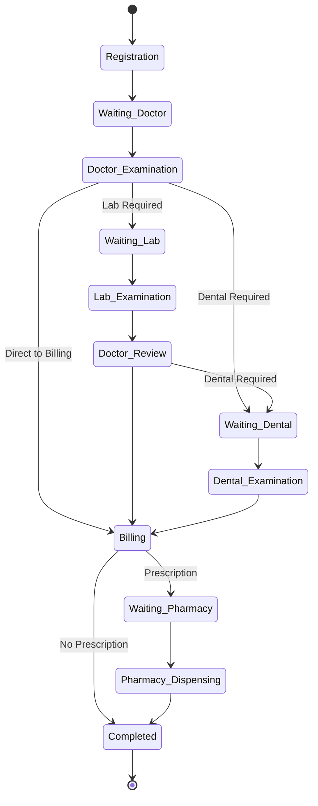

# Design Document

## Overview

The Clinic Flow System is designed as a comprehensive healthcare management solution that orchestrates the complete patient journey from registration through various medical services to final billing and pharmacy dispensing. The system builds upon the existing Laravel-based architecture with modular components for each healthcare department, ensuring seamless data flow and operational efficiency.

The design follows a service-oriented architecture pattern with clear separation of concerns, leveraging the existing Eloquent ORM models and relationships while introducing new workflow management components to handle patient flow, queue management, and inter-departmental communication.

## Architecture

### System Architecture Pattern
The system follows a **Layered Architecture** with **Service-Oriented** components:

```
┌─────────────────────────────────────────────────────────────┐
│                    Presentation Layer                        │
│  ┌─────────────┐ ┌─────────────┐ ┌─────────────┐ ┌─────────┐│
│  │Registration │ │Examination  │ │Laboratory   │ │Pharmacy ││
│  │    UI       │ │     UI      │ │     UI      │ │   UI    ││
│  └─────────────┘ └─────────────┘ └─────────────┘ └─────────┘│
└─────────────────────────────────────────────────────────────┘
┌─────────────────────────────────────────────────────────────┐
│                   Application Layer                         │
│  ┌─────────────┐ ┌─────────────┐ ┌─────────────┐ ┌─────────┐│
│  │Patient Flow │ │Workflow     │ │Queue        │ │Billing  ││
│  │  Service    │ │ Manager     │ │ Manager     │ │Service  ││
│  └─────────────┘ └─────────────┘ └─────────────┘ └─────────┘│
└─────────────────────────────────────────────────────────────┘
┌─────────────────────────────────────────────────────────────┐
│                    Domain Layer                             │
│  ┌─────────────┐ ┌─────────────┐ ┌─────────────┐ ┌─────────┐│
│  │Patient      │ │Examination  │ │Laboratory   │ │Drug     ││
│  │  Model      │ │   Model     │ │   Model     │ │ Model   ││
│  └─────────────┘ └─────────────┘ └─────────────┘ └─────────┘│
└─────────────────────────────────────────────────────────────┘
┌─────────────────────────────────────────────────────────────┐
│                 Infrastructure Layer                        │
│  ┌─────────────┐ ┌─────────────┐ ┌─────────────┐ ┌─────────┐│
│  │Database     │ │File Storage │ │Queue System │ │External ││
│  │  (MySQL)    │ │             │ │   (Redis)   │ │   APIs  ││
│  └─────────────┘ └─────────────┘ └─────────────┘ └─────────┘│
└─────────────────────────────────────────────────────────────┘
```

### Core Workflow Engine
The system introduces a **Workflow Engine** that manages patient flow states and transitions:



## Components and Interfaces

### 1. Patient Flow Management Component

**Purpose:** Orchestrates patient movement through different departments and manages workflow states.

**Key Classes:**
- `PatientFlowService`: Main orchestrator for patient workflow
- `WorkflowState`: Enum defining all possible patient states
- `FlowTransition`: Handles state transitions and validations

**Interface:**
```php
interface PatientFlowServiceInterface
{
    public function registerPatient(array $patientData): PatientFlow;
    public function transitionTo(int $patientId, WorkflowState $newState): bool;
    public function getCurrentState(int $patientId): WorkflowState;
    public function getNextAvailableStates(int $patientId): array;
    public function completeCurrentStep(int $patientId, array $data): bool;
}
```

### 2. Queue Management Component

**Purpose:** Manages patient queues across all departments with real-time updates.

**Key Classes:**
- `QueueManager`: Central queue management
- `DepartmentQueue`: Department-specific queue handling
- `QueueNotification`: Real-time queue updates

**Interface:**
```php
interface QueueManagerInterface
{
    public function addToQueue(int $patientId, string $department): QueuePosition;
    public function callNext(string $department): ?Patient;
    public function getQueuePosition(int $patientId, string $department): int;
    public function estimateWaitTime(string $department): int;
    public function updateQueueStatus(int $patientId, string $status): bool;
}
```

### 3. Enhanced Registration Component

**Purpose:** Handles both new and returning patient registration with improved data validation.

**Key Classes:**
- `PatientRegistrationService`: Enhanced registration logic
- `PatientValidator`: Comprehensive data validation
- `InsuranceVerifier`: Insurance validation and verification

**Interface:**
```php
interface PatientRegistrationServiceInterface
{
    public function registerNewPatient(array $data): Patient;
    public function updateExistingPatient(int $patientId, array $data): Patient;
    public function searchPatient(string $criteria): Collection;
    public function verifyInsurance(array $insuranceData): InsuranceVerification;
    public function generatePatientCode(): string;
}
```

### 4. Examination Workflow Component

**Purpose:** Manages medical examinations with integrated documentation and referral systems.

**Key Classes:**
- `ExaminationService`: Core examination management
- `MedicalDocumentationService`: Handles medical records
- `ReferralService`: Manages inter-departmental referrals

**Interface:**
```php
interface ExaminationServiceInterface
{
    public function startExamination(int $patientId, int $doctorId): Examination;
    public function recordVitalSigns(int $examinationId, array $vitals): bool;
    public function addDiagnosis(int $examinationId, array $diagnosis): bool;
    public function createReferral(int $examinationId, string $department, array $details): Referral;
    public function completeExamination(int $examinationId, array $summary): bool;
}
```

### 5. Laboratory Management Component

**Purpose:** Handles laboratory test requests, specimen tracking, and result management.

**Key Classes:**
- `LaboratoryService`: Main laboratory operations
- `SpecimenTracker`: Tracks specimen collection and processing
- `ResultValidator`: Validates and flags critical results

**Interface:**
```php
interface LaboratoryServiceInterface
{
    public function createTestRequest(int $examinationId, array $tests): TestRequest;
    public function collectSpecimen(int $requestId, array $specimenData): Specimen;
    public function enterResults(int $requestId, array $results): bool;
    public function validateResults(int $requestId): ValidationResult;
    public function notifyPhysician(int $requestId): bool;
}
```

### 6. Dental Care Component

**Purpose:** Specialized dental examination system with odontogram support.

**Key Classes:**
- `DentalExaminationService`: Dental-specific examinations
- `OdontogramService`: Dental chart management
- `DentalImagingService`: Integration with dental imaging systems

**Interface:**
```php
interface DentalExaminationServiceInterface
{
    public function startDentalExam(int $patientId, int $dentistId): DentalExamination;
    public function updateOdontogram(int $examId, array $toothData): bool;
    public function recordProcedure(int $examId, array $procedureData): DentalProcedure;
    public function attachImaging(int $examId, array $imageData): bool;
    public function generateTreatmentPlan(int $examId): TreatmentPlan;
}
```

### 7. Enhanced Billing Component

**Purpose:** Comprehensive billing system with insurance integration and payment processing.

**Key Classes:**
- `BillingService`: Core billing operations
- `InsuranceClaimService`: Insurance claim processing
- `PaymentProcessor`: Multiple payment method support

**Interface:**
```php
interface BillingServiceInterface
{
    public function generateBill(int $examinationId): Bill;
    public function processPayment(int $billId, array $paymentData): PaymentResult;
    public function submitInsuranceClaim(int $billId): ClaimSubmission;
    public function createPaymentPlan(int $billId, array $planData): PaymentPlan;
    public function generateReceipt(int $paymentId): Receipt;
}
```

### 8. Pharmacy Integration Component

**Purpose:** Seamless prescription processing with inventory management and drug interaction checking.

**Key Classes:**
- `PharmacyService`: Main pharmacy operations
- `PrescriptionProcessor`: Prescription validation and processing
- `DrugInteractionChecker`: Safety validation
- `InventoryManager`: Stock management

**Interface:**
```php
interface PharmacyServiceInterface
{
    public function receivePrescription(int $examinationId): Prescription;
    public function validatePrescription(int $prescriptionId): ValidationResult;
    public function checkDrugInteractions(array $medications): InteractionResult;
    public function dispenseMedication(int $prescriptionId): DispensingRecord;
    public function updateInventory(int $drugId, int $quantity): bool;
}
```

## Data Models

### Enhanced Patient Flow Model
```php
class PatientFlow extends Model
{
    protected $fillable = [
        'patient_id',
        'current_state',
        'previous_state',
        'queue_number',
        'estimated_completion',
        'priority_level',
        'notes'
    ];
    
    protected $casts = [
        'current_state' => WorkflowState::class,
        'previous_state' => WorkflowState::class,
        'estimated_completion' => 'datetime'
    ];
}
```

### Queue Management Model
```php
class QueueEntry extends Model
{
    protected $fillable = [
        'patient_id',
        'department',
        'queue_number',
        'status',
        'called_at',
        'completed_at',
        'estimated_wait_time'
    ];
    
    protected $casts = [
        'called_at' => 'datetime',
        'completed_at' => 'datetime'
    ];
}
```

### Enhanced Examination Model Extensions
```php
// Extending existing Examination model with workflow integration
class Examination extends Model
{
    // ... existing code ...
    
    public function patientFlow()
    {
        return $this->hasOne(PatientFlow::class, 'patient_id', 'patient_id');
    }
    
    public function referrals()
    {
        return $this->hasMany(Referral::class);
    }
    
    public function queueEntries()
    {
        return $this->hasMany(QueueEntry::class, 'patient_id', 'patient_id');
    }
}
```

### Laboratory Enhancement Model
```php
class TestRequest extends Model
{
    protected $fillable = [
        'examination_id',
        'requested_tests',
        'priority',
        'specimen_requirements',
        'status',
        'requested_by',
        'requested_at'
    ];
    
    protected $casts = [
        'requested_tests' => 'array',
        'specimen_requirements' => 'array',
        'requested_at' => 'datetime'
    ];
}
```

### Dental Examination Model
```php
class DentalExamination extends Model
{
    protected $fillable = [
        'examination_id',
        'odontogram_data',
        'procedures_performed',
        'imaging_references',
        'treatment_plan',
        'follow_up_required'
    ];
    
    protected $casts = [
        'odontogram_data' => 'array',
        'procedures_performed' => 'array',
        'imaging_references' => 'array',
        'treatment_plan' => 'array'
    ];
}
```

### Enhanced Prescription Model
```php
class Prescription extends Model
{
    protected $fillable = [
        'examination_id',
        'prescribed_medications',
        'dosage_instructions',
        'interaction_warnings',
        'dispensing_status',
        'prescribed_by',
        'dispensed_by',
        'dispensed_at'
    ];
    
    protected $casts = [
        'prescribed_medications' => 'array',
        'dosage_instructions' => 'array',
        'interaction_warnings' => 'array',
        'dispensed_at' => 'datetime'
    ];
}
```

## Error Handling

### Workflow Error Management
- **State Transition Errors**: Validate all state transitions and provide clear error messages
- **Queue Management Errors**: Handle queue overflow and department unavailability
- **Data Validation Errors**: Comprehensive validation with user-friendly error messages
- **Integration Errors**: Graceful handling of external system failures

### Exception Hierarchy
```php
abstract class ClinicFlowException extends Exception {}

class InvalidStateTransitionException extends ClinicFlowException {}
class QueueOverflowException extends ClinicFlowException {}
class PatientNotFound Exception extends ClinicFlowException {}
class DepartmentUnavailableException extends ClinicFlowException {}
class InsuranceVerificationException extends ClinicFlowException {}
class PrescriptionValidationException extends ClinicFlowException {}
```

## Testing Strategy

### Unit Testing
- **Service Layer Testing**: Test all service methods with mock dependencies
- **Model Testing**: Validate model relationships and data integrity
- **Validation Testing**: Test all input validation rules
- **State Management Testing**: Verify workflow state transitions

### Integration Testing
- **Department Integration**: Test inter-departmental data flow
- **Queue System Integration**: Test real-time queue updates
- **Payment Processing Integration**: Test payment gateway integration
- **External API Integration**: Test insurance verification and other external services

### End-to-End Testing
- **Complete Patient Journey**: Test full workflow from registration to completion
- **Multi-Department Scenarios**: Test complex patient flows involving multiple departments
- **Error Recovery Testing**: Test system behavior during failures and recovery

### Performance Testing
- **Queue Performance**: Test system performance under high patient load
- **Database Performance**: Test query performance with large datasets
- **Real-time Updates**: Test WebSocket performance for queue notifications
- **Concurrent User Testing**: Test system behavior with multiple simultaneous users

The design ensures scalability, maintainability, and seamless integration with the existing Laravel-based clinic management system while providing comprehensive workflow management and enhanced user experience across all departments.